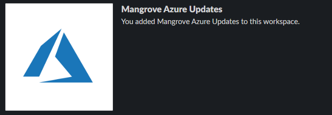
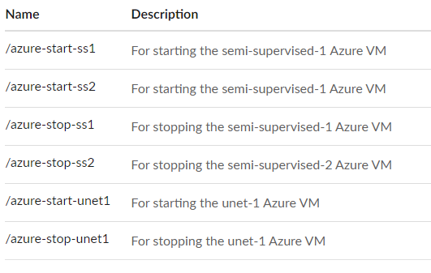
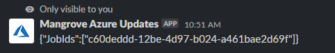
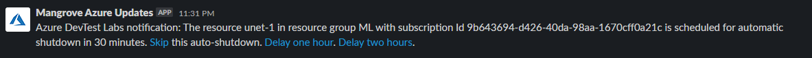

# Mangrove Azure Updates

Mangrove Azure Updates is a slack app developed to make it easier to manage VMs used for data processing and to recieved status updates on those VMs.

## Turning on and off VMs

You can turn of VMs using the commands given below. You can type any of the below commands to turn on and off a specific VM in any channel. 

 

**Note:** After you type in the above commands, wait at least a minute before trying to log into the VM, as it needs time to start up! If the request to start the VM is successful, you should get a message that is visible only to you, with the specific job id of the VM startup job given to Azure. **Below is an example message of one that you should recieve upon a successful job request.**

 

## Autoshutdown

Each VM is set to shut down every midnight (12:00 AM PST). If you are doing overnight processing, make sure to go to the **#azure** channel in order to see updates on automatic shutdowns. Below is an example image for a VM that is left on. **This automatic message will be posted 30 minutes before shutdown, (~11:30 PM PST)**, so make sure to stay online to ensure that you can see this message. 

You can either skip the automatic shutdown, with the VM staying on until the next automatic shutdown. If you just need time to save your work and shut down, you can also delay the automatic shutdown by 1 or two hours by clicking on the links in the message sent by @Mangrove Azure Updates. 

 
 
 

| Author  | Email  |
|---|---|
| Dillon Hicks  | sdhicks@ucsd.edu  |