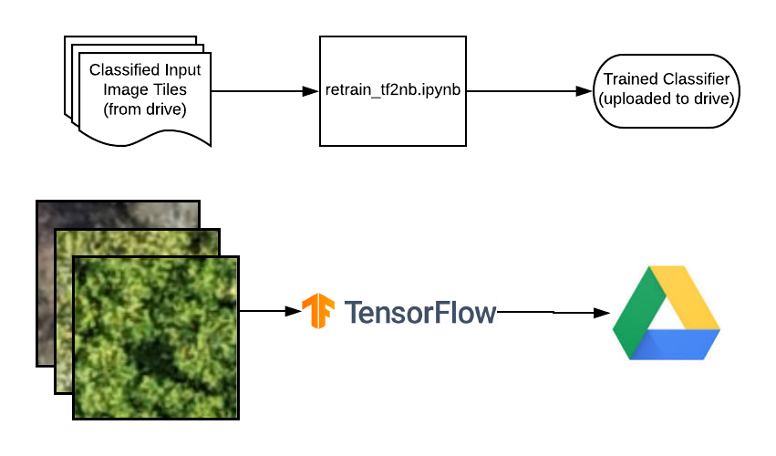
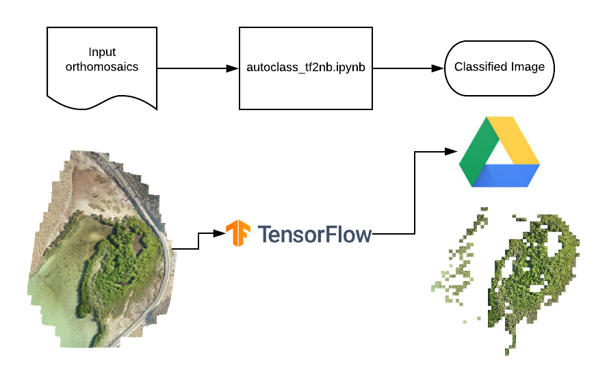

## CNN Tile Based Classification

## Tensorflow 2.0 Notebooks

Upgrades to Tensorflow 2.0 brings much more optimization compared to Tensorflow 1.0 and many more models, Seeing up to 10x increases in classification speeds, plus the code is much easier to read and know what is going on! View the below notebooks to get an intro into the code

## Retrain (TF2 Notebook)

Retrain is used to retrain a CNN tile classifier model using the training data uploaded to the drive. This notebook is written with Google Colab, so it makes use of drive storage for easy downloading of data and uploading of models. 

## Autoclass (TF2 Notebook)

Autoclass is used to take an input orthomosaic and output a classified orthomosaic representing the specified mangrove classes. Like Retrain, this notebook is written with Colab, making it easy to download orthomosaics and upload the classified orthomosaics.

