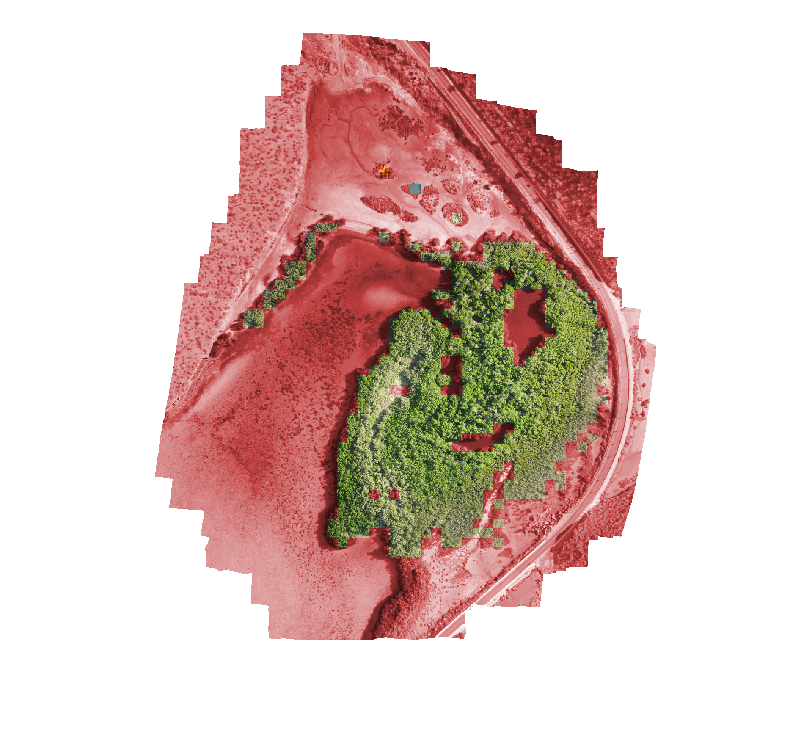

## CNN Tile Based Classification

## Tensorflow 2.0 Notebooks

Upgrades to Tensorflow 2.0 brings much more optimization compared to Tensorflow 1.0 and many more models, Seeing up to 10x increases in classification speeds, plus the code is much easier to read and know what is going on! View the below notebooks to get an intro into the code

### Retrain (TF2 Notebook)

### Autoclass (TF2 Notebook)

