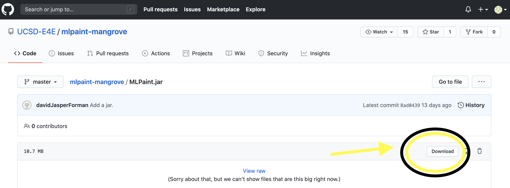

# Welcome to Magic Label Paint, a user interface for ML-assisted labeling.
    beta internal mangrove release
    Soon we will have a setup tutorial and a document on the computer science behind this labeling tool.

# Download the application

[Go to the github page and download.](https://github.com/UCSD-E4E/mlpaint-mangrove/blob/master/MLPaint.jar)

# Running the .JAR file

MLPaint is a Java programming language .jar desktop application. To run it, you will need to have Java installed on your computer. Even if you have Java already installed, you may need to Google how to update it to Java 11. 

Windows: All that should be covered in 
[this video for Windows.](https://www.youtube.com/watch?v=ifBlevULGtM)

Mac: 

1) [How to download Java](https://treehouse.github.io/installation-guides/mac/jdk-mac.html)
You will need at least Java SE 11.

2) [How to run a .jar file](https://www.youtube.com/watch?v=WkTt70O6SwI)
This video explains how to use Mac Terminal to navigate to your file:
    1) Use "ls" to see your directory names
    2) Use "cd" to enter a directory.
    3) Once you are in the same directory as the .jar file, run "java -jar MLPaint.jar"

# Labeling Setup Tutorial

    Navigate to the image, probably a .tif, that you want to open, and open it!
        
# Labeling Workflow Tutorial
<iframe width="560" height="315" src="https://www.youtube.com/embed/uAIU2VNW9_g" frameborder="0" allow="accelerometer; autoplay; encrypted-media; gyroscope; picture-in-picture" allowfullscreen></iframe>

