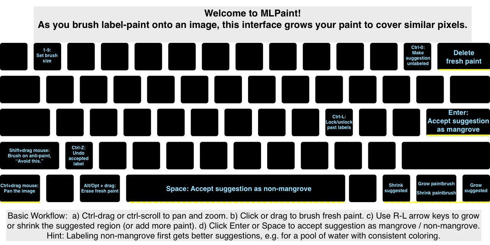

# Welcome to Magic Label Paint, a user interface for ML-assisted labeling.
    beta internal release
    Soon we will have a setup tutorial and a document on the computer science behind this labeling tool.

#Here is a tutorial.
<iframe width="560" height="315" src="https://www.youtube.com/embed/uAIU2VNW9_g" frameborder="0" allow="accelerometer; autoplay; encrypted-media; gyroscope; picture-in-picture" allowfullscreen></iframe>

