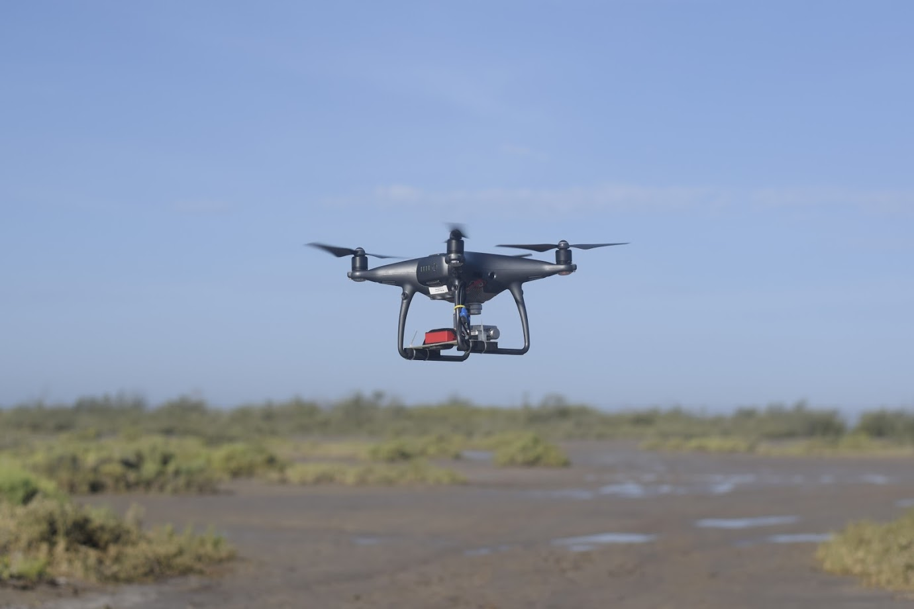
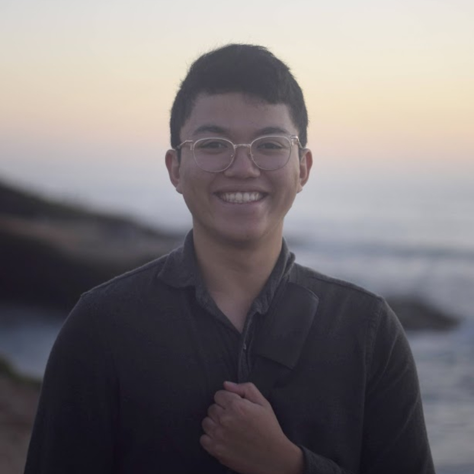

##Welcome to the E4E Mangrove Monitoring Documentation Hub!

## Github

**For all code references, please go to the E4E Github below**

<https://github.com/UCSD-E4E/mangrove>

## Current Team

| |                |                 |
|:------------:|:--------------:|:---------------:|
| **Dillon Hicks** |  **Kathy Qi **             |                 |
|   Technical Lead        |  .               |                 |
|   **Arden Ma**   |   **Matthew Ma**   | **Ashlesha Vaidya** |
|    CNN/UNet            |  .              | Semi-Supervised               |
| **David Forman - REU **  | **Nicole Meister - REU** |                 |
|  Labeling Tool          |  .           |                 |

### PI's and Collaborators/Mentors

**E4E (JSOE)**

Ryan Kastner 

Curt Schurgers

Eric Lo

**Aburto Lab (SIO)**

Octavio Aburto

Astrid Hsu

John Dorian

