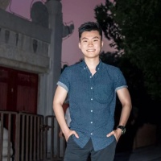
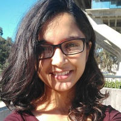
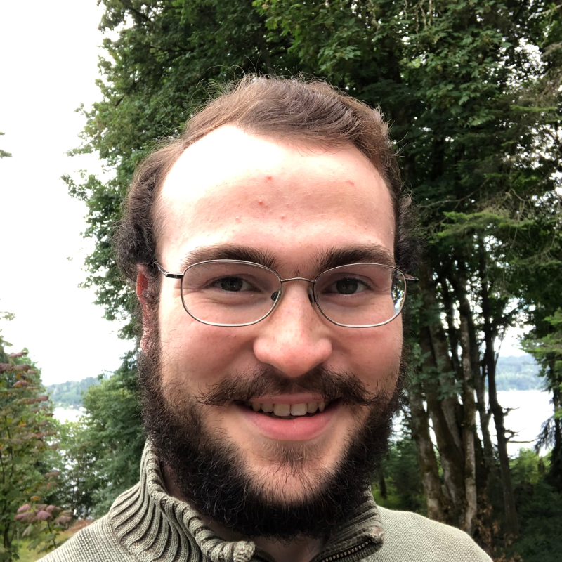

##Welcome to the E4E Mangrove Monitoring Documentation Hub!

## Github

**For all code references, please go to the Github repositories below**

General Tools and Documentation: <https://github.com/UCSD-E4E/mangrove>

Machine Learning Development: <https://github.com/UCSD-E4E/ml-mangrove>

Image Classification Tool: <https://github.com/UCSD-E4E/web-mangrove>

Image Labeling Tool: <https://github.com/UCSD-E4E/labeling-mangrove>

Biomass Estimation: <https://github.com/UCSD-E4E/biomass-mangrove>
## Current Team

|              |                |                 |
|:------------:|:--------------:|:---------------:|
| **Dillon Hicks** |  **Kathy Qi**  |   **Arden Ma**    |
|   *Technical Lead*        |    *Biomass*          |  *UNet Segmentation /CNN*               |
|   **Matthew Ma**   | **Ashlesha Vaidya** | **David Forman - REU**  |     
|  *UNet Segmentation*             |*Semi-Supervised Segmentation*     |   *Labeling Tool*  |
| **Nicole Meister - REU** |  **Samuel Cole - REU** | **Thuan Do - HS** |  
| *Image Classification Tool*           |   *UNet Segmentation*       |     |

### PI's and Collaborators/Mentors

**E4E (JSOE)**

Ryan Kastner 

Curt Schurgers

Eric Lo

**Aburto Lab (SIO)**

Octavio Aburto

Astrid Hsu

John Dorian

